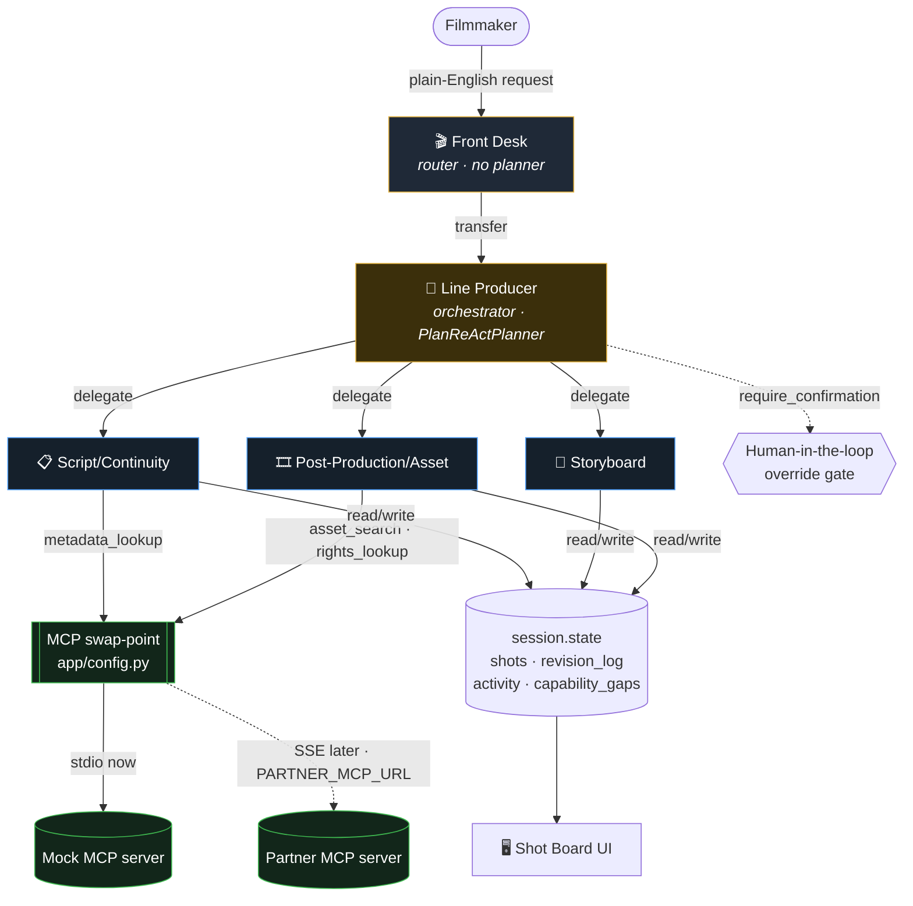
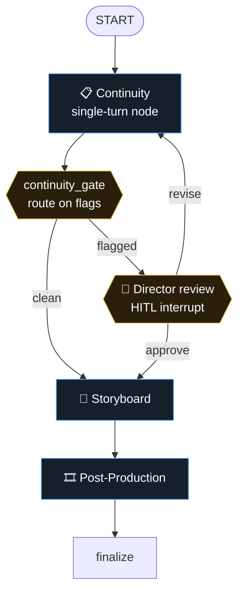
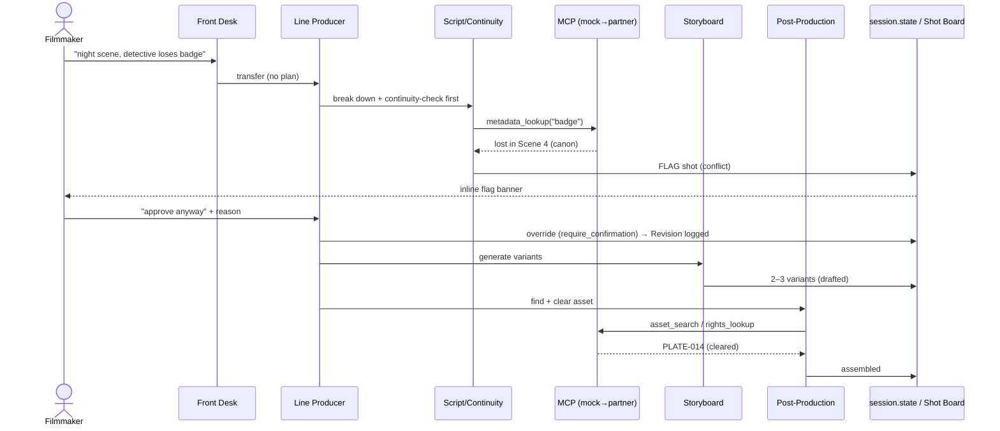

# Scripervisor — Architecture

An open, extensible multi-agent film production **crew** on Google ADK. A
coordinator delegates across role-agents that break a filmmaker's plain-English
request into continuity-checked, pre-visualised **Shots** on a live **Shot Board**.
Terms used below are pinned in [`../CONTEXT.md`](../CONTEXT.md).

## Components

| Component | Where | Responsibility |
|---|---|---|
| **Front Desk** | `app/sub_agents/front_desk.py` | User-facing router. Collects the request, lightly validates, hands off. No planner, no creative authority. |
| **Line Producer** | `app/sub_agents/line_producer.py` | Orchestrator with `PlanReActPlanner`. Owns breakdown, delegation, tool/model choice, and the human-in-the-loop override gate. |
| **Script/Continuity** | `app/sub_agents/script_continuity.py` | Cross-references new content against **Canon** (via MCP `metadata_lookup`) and raises **Flags**. Reasoning only. |
| **Storyboard** | `app/sub_agents/storyboard.py` | Generates 2–3 rough **Variants** per Shot (pick-then-polish). |
| **Post-Production/Asset** | `app/sub_agents/post_production.py` | Retrieves existing footage (MCP `asset_search`), clears rights (`rights_lookup`), **Assembles** it. Retrieval, not generation. |
| **Shared tools** | `app/tools.py` | `session.state` mutators: shot board, revision log, capability gaps, and the `require_confirmation` override. |
| **MCP swap-point** | `app/config.py` | One function returns an `McpToolset` bound to the mock (stdio) or the partner (`PARTNER_MCP_URL`, SSE). |
| **Mock MCP server** | `mcp_server/mock_server.py` | FastMCP stub: `metadata_lookup` / `asset_search` / `rights_lookup`. Stands in for the partner endpoint (revealed week of Jul 27). |
| **A2A / HTTP server** | `app/fast_api_app.py` | Serves the crew over A2A (agent card + JSON-RPC) via the ADK `adk_a2a` template. |
| **Workflow graph** | `app/workflow.py` | ADK 2.0 `Workflow`: the same crew as a graph — conditional routing, a director-review HITL interrupt, and a revise→re-check feedback loop. |
| **Shot Board UI** | `frontend/` | Three-panel console rendering from the `session.state` shape. |

## Two orchestration modes

The crew ships with two entrypoints over the same role-agents, both on **ADK 2.x**.

### 1. Hierarchical crew — `app/agent.py`

LLM-driven delegation: the Line Producer (the only planner) transfers to a
role-agent, and control transfers **back** when that agent is done — ADK
sub-agent transfer is bidirectional, not a one-way waterfall. The Front Desk is
a deliberately thin router (see [ADR 0001](./adr/0001-front-desk-no-planning-authority.md)).
This entrypoint is A2A/live-capable.



### 2. Workflow graph — `app/workflow.py` (ADK 2.0)

The same work as an ADK 2.0 `Workflow` graph, where orchestration is **explicit
edges** rather than an LLM's transfer decisions — which makes the feedback loop
first-class (see [ADR 0002](./adr/0002-adopt-adk-2.0-workflow-graph.md)).



The `revise → Continuity` edge is a **real routed cycle**: a flagged shot goes
back for a fresh check, not forward regardless. Continuity signals the gate via
`session.state` (so it keeps its MCP/flag tools — an `output_schema` would
disable them). Role-agents are reused as single-turn nodes.

## Shared orchestration rules

- **Continuity-first**: a Script/Continuity pass runs before anything is drawn or
  assembled (the Line Producer's instruction in mode 1; the graph's first edge in mode 2).
- **Human-in-the-loop**: mode 1 uses a `require_confirmation` override tool; mode 2
  uses a `RequestInput` interrupt node. Either way the director's reason becomes
  the Revision rationale.

## Data flow — one representative request

Request: *"Add a night scene where the detective loses her badge."*

1. **Filmmaker → Front Desk**: submits the request in plain English.
2. **Front Desk → Line Producer**: confirms understanding, transfers. Makes no plan.
3. **Line Producer**: breaks it into Shots; transfers to Script/Continuity first.
4. **Script/Continuity → MCP**: `metadata_lookup("badge")` → canon says *badge already lost in Scene 4*.
5. **Script/Continuity**: raises a **Flag** on the shot (conflict: badge can't be lost twice).
6. **Line Producer → Filmmaker**: surfaces the conflict; on "approve anyway" calls the `require_confirmation` override, capturing the reason → **Revision** log.
7. **Line Producer → Storyboard**: generates 2–3 **Variants** for the corrected shot.
8. **Line Producer → Post-Production**: `asset_search` finds a night city plate, `rights_lookup` clears it → **Assembled**.
9. **Shot Board UI**: reflects each status change live (drafted → flagged → approved → assembled), plus skill badges and the revision log.



## Status state machine

A Shot's `status` is a state machine, not a free label. A **Flag** can interrupt
from any state; a Shot never regresses from Approved/Assembled/Rendered.

```
drafted ──▶ flagged ──(override, reason)──▶ approved ──▶ assembled  (existing asset attached)
   │                                            │
   └────────────── clean ───────────────────────┘        └──▶ rendered (original polished frame)
```

## External dependencies

- **Google ADK 2.x** (`google-adk >= 2.0`, running 2.5.x) — `Agent`, `PlanReActPlanner`, `McpToolset`, `require_confirmation`, `Runner`, `App`, and the 2.0 `Workflow` graph API (`Workflow`, `node`, `RequestInput`).
- **Gemini via Vertex AI** — reasoning/routing model (`gemini-flash-latest` default); Imagen for real storyboard frames (mock generator today).
- **A2A** (`a2a-sdk`) — the crew is exposed as an A2A agent (card + JSON-RPC) so other agentic tools can call it.
- **MCP** (`mcp`) — partner asset/metadata/rights server; local mock stub until the roster reveal.

## Extensibility — the differentiator

- **Skills**: loadable capability bundles that extend any agent at runtime without forking (on-disk format planned per the skill-loader design).
- **Capability gaps**: when an agent hits something it can't do, `report_capability_gap` files structured telemetry naming the Skill that would close it — gap → skill request → loadable by every crew. Not a forum.
